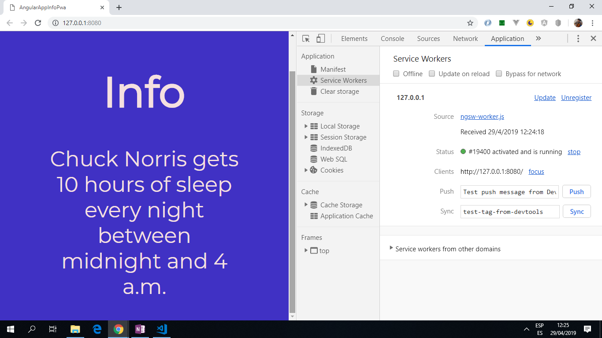

# Angular App Info PWA

* App to display information from an API. A service-worker is used to make this a Progressive Web Application (PWA).

*** Note: to open web links in a new window use: _ctrl+click on link_**

## Table of contents

* [General info](#general-info)
* [Screenshots](#screenshots)
* [Technologies](#technologies)
* [Setup](#setup)
* [Features](#features)
* [Status](#status)
* [Inspiration](#inspiration)
* [Contact](#contact)

## General info

* Angular httpClient used to get API data.

* Progressive Web App: runs in the browser and manages data caching so API info is still displayed in the event of loss of network. All PWAs require HTTPS (hypertext transport secure). They require a TLS (SSL - Secure Sockets Layer) or Digital certificate.

## Screenshots

.

## Technologies

* [Angular v7.2.14](https://angular.io/) & [Angular CLI v7.3.8](https://cli.angular.io/).

* [RxJS Library v6.5.1](https://angular.io/guide/rx-library) used to [subscribe](http://reactivex.io/documentation/operators/subscribe.html) to the API data [observable](http://reactivex.io/documentation/observable.html).

* [Angular service worker v7.2.14](https://angular.io/guide/service-worker-intro)

## Setup

**To see changes to app code:**

Run `ng serve` for a dev server. Navigate to `http://localhost:4200/`. The app will automatically reload if you change any of the source files.

**Once code changes complete:**

1. Run `ng build --prod` to create the build file.
2. Navigate to `\angular-app-infoPwa\dist\angular-app-infoPwa\`.
3. Type `http-server -o` and navigate to `http://192.168.0.104:8080` to see API working with the service worker in operation.
4. You should see something like:

  `_Starting up http-server, serving ./
  Available on:
  http://192.168.0.104:8080
  http://127.0.0.1:8080
  Hit CTRL-C to stop the server_`

## Code Examples

* `data.service.ts` using httpClient service with a `getInfo()` function to get user details from the API.

```typescript

import { Injectable } from '@angular/core';
import { HttpClient } from '@angular/common/http';

@Injectable({
  providedIn: 'root'
})
export class DataService {

  constructor(private http: HttpClient) { }

  getInfo() {
    return this.http.get('https://api.chucknorris.io/jokes/random');
  }
}

```

## PWA/Angular Features

* Manifest.json file

* [ngsw-config.json](https://angular.io/guide/service-worker-config) file: specifies which files and data URLs the service worker should cache and how it should update the cached files and data. Also has a url for fonts to use when offline. Other settings, including dataGroups "freshness" strategy option.

* [SwUpdate](https://angular.io/api/service-worker/SwUpdate) module used to subscribe to update notifications from the Service Worker, trigger update checks, and forcibly activate updates.

* Updated to latest Angular 7 version with all dependency conflicts resolved.

## Status & To-Do List

* Status: Simple working app that displays API data with a fully working service worker.

* To-Do: Update CSS to present info better or use Anular Mat cards. Change to reference a new API with more useful data and display more fields.

## Inspiration

* [Coursetro tutorial: Build your First Angular PWA from Scratch (Angular 6 PWA Tutorial)](https://www.youtube.com/watch?v=othhfZ0mGjU)

* [Angular Documentation: service worker introduction](https://angular.io/guide/service-worker-intro)

## Contact

Created by [ABateman](https://www.andrewbateman.org) - feel free to contact me!
